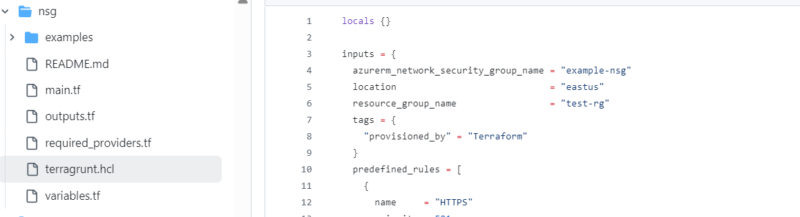
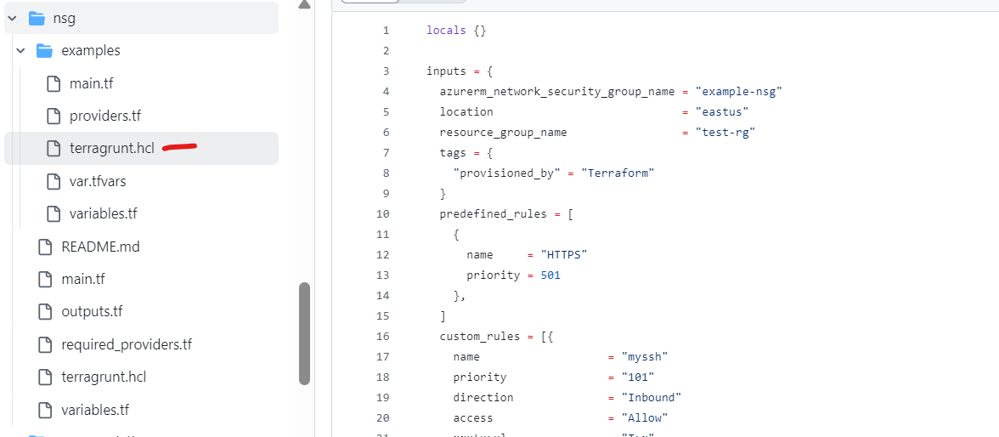
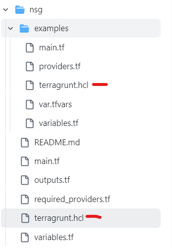

# tf-modules-azure

This module aims to have all the modules that are used to deploy to azure as well as related applications such as databricks

<!-- TOC -->

- [tf-modules-azure](#tf-modules-azure)
    - [Modules](#modules)
    - [Adopting Terragrunt: Workflow Guidelines](#adopting-terragrunt-workflow-guidelines)
    - [Related Information](#related-information)
        - [Regions and Network space](#regions-and-network-space)
        - [DNS Servers](#dns-servers)
            - [West Central US](#west-central-us)
            - [North Central US](#north-central-us)
            - [East US 2](#east-us-2)
            - [Central US](#central-us)
    - [CHANGELOG](#changelog)
    - [How to contribute](#how-to-contribute)

<!-- /TOC -->

## Modules

| Folder | README | Example | AVM |
|--------|--------|---------|-----|
| [Standard_Tags](./Standard_Tags) | [README.md](./Standard_Tags/README.md) |  | :x: |
| [associate_gcp_eas](./aad/associate_gcp_eas) | [README.md](./aad/associate_gcp_eas/README.md) |  | :x: |
| [group](./aad/group) | [README.md](./aad/group/README.md) |  | :x: |
| [microsoft_template_group](./aad/microsoft_template_group) | [README.md](./aad/microsoft_template_group/README.md) |  | :x: |
| [acr](./acr) | [README.md](./acr/README.md) | [examples](./acr/examples) | :white_check_mark: |
| [action-groups](./action-groups) | [README.md](./action-groups/README.md) | [examples](./action-groups/examples) | :x: |
| [ai-search](./ai-search) | [README.md](./ai-search/README.md) | [examples](./ai-search/examples) | :white_check_mark: |
| [ai-studio](./ai-studio) | [README.md](./ai-studio/README.md) | [examples](./ai-studio/examples) | :x: |
| [aks](./aks) | [README.md](./aks/README.md) | [examples](./aks/examples) | :white_check_mark: |
| [alerts](./alerts) | [README.md](./alerts/README.md) | [examples](./alerts/examples) | :x: |
| [api-management](./api-management) | [README.md](./api-management/README.md) |  | :x: |
| [app-gateway](./app-gateway) | [README.md](./app-gateway/README.md) | [examples](./app-gateway/examples) | :white_check_mark: |
| [v2](./app-gateway/v2) | [README.md](./app-gateway/v2/README.md) |  | :x: |
| [v3](./app-gateway/v3) | [README.md](./app-gateway/v3/README.md) |  | :x: |
| [app-insight](./app-insight) | [README.md](./app-insight/README.md) | [examples](./app-insight/examples) | :white_check_mark: |
| [azure-virtual-machine](./appdynamics/azure-virtual-machine) | [README.md](./appdynamics/azure-virtual-machine/README.md) |  | :x: |
| [appdynamics](./appdynamics) | [README.md](./appdynamics/README.md) |  | :x: |
| [availability_sets](./availability_sets) | [README.md](./availability_sets/README.md) | [examples](./availability_sets/examples) | :x: |
| [avd-application-group](./avd-application-group) | [README.md](./avd-application-group/README.md) | [examples](./avd-application-group/examples) | :white_check_mark: |
| [avd-host-pools](./avd-host-pools) | [README.md](./avd-host-pools/README.md) | [examples](./avd-host-pools/examples) | :white_check_mark: |
| [avd-insights](./avd-insights) | [README.md](./avd-insights/README.md) | [examples](./avd-insights/examples) | :white_check_mark: |
| [avd-management-plane](./avd-management-plane) | [README.md](./avd-management-plane/README.md) | [examples](./avd-management-plane/examples) | :white_check_mark: |
| [avd-scaling-plan](./avd-scaling-plan) | [README.md](./avd-scaling-plan/README.md) | [examples](./avd-scaling-plan/examples) | :white_check_mark: |
| [avd-workspace](./avd-workspace) | [README.md](./avd-workspace/README.md) | [examples](./avd-workspace/examples) | :white_check_mark: |
| [azure-bot-service](./azure-bot-service) | [README.md](./azure-bot-service/README.md) | [example](./azure-bot-service/example) | :x: |
| [azure-firewall-policy](./azure-firewall-policy) | [README.md](./azure-firewall-policy/README.md) | [examples](./azure-firewall-policy/examples) | :white_check_mark: |
| [azure-firewall](./azure-firewall) | [README.md](./azure-firewall/README.md) | [examples](./azure-firewall/examples) | :white_check_mark: |
| [azure_monitor_workbook](./azure_monitor_workbook) | [README.md](./azure_monitor_workbook/README.md) | [examples](./azure_monitor_workbook/examples) | :x: |
| [backup-protected-file-share](./backup-protected-file-share) | [README.md](./backup-protected-file-share/README.md) | [examples](./backup-protected-file-share/examples) | :x: |
| [bastion-host](./bastion-host) | [README.md](./bastion-host/README.md) | [example](./bastion-host/example) | :white_check_mark: |
| [vm-legacy](./blueprints/vm-legacy) | [README.md](./blueprints/vm-legacy/README.md) |  | :x: |
| [waf-frontdoor-classic-legacy](./blueprints/waf-frontdoor-classic-legacy) | [README.md](./blueprints/waf-frontdoor-classic-legacy/README.md) |  | :x: |
| [waf-legacy](./blueprints/waf-legacy) | [README.md](./blueprints/waf-legacy/README.md) |  | :x: |
| [consumption_budget](./consumption_budget) | [README.md](./consumption_budget/README.md) | [examples](./consumption_budget/examples) | :x: |
| [cosmos-db-account](./cosmos-db-account) | [README.md](./cosmos-db-account/README.md) |  | :x: |
| [cosmos-sql-db](./cosmos-sql-db) | [README.md](./cosmos-sql-db/README.md) |  | :x: |
| [cosmosdb](./cosmosdb) | [README.md](./cosmosdb/README.md) | [examples](./cosmosdb/examples) | :white_check_mark: |
| [custom-role-definition](./custom-role-definition) | [README.md](./custom-role-definition/README.md) | [examples](./custom-role-definition/examples) | :x: |
| [data-protection-backup](./data-protection-backup) | [README.md](./data-protection-backup/README.md) | [examples](./data-protection-backup/examples) | :x: |
| [data_collection_rules](./data_collection_rules) | [README.md](./data_collection_rules/README.md) | [examples](./data_collection_rules/examples) | :x: |
| [databricks-serverless-compute](./databricks-serverless-compute) | [README.md](./databricks-serverless-compute/README.md) | [examples](./databricks-serverless-compute/examples) | :x: |
| [databricks](./databricks) | [README.md](./databricks/README.md) |  | :x: |
| [v2](./databricks/v2) | [README.md](./databricks/v2/README.md) |  | :x: |
| [dataexplorer](./dataexplorer) | [README.md](./dataexplorer/README.md) |  | :x: |
| [datafactory](./datafactory) | [README.md](./datafactory/README.md) |  | :x: |
| [diagnostic-setting](./diagnostic-setting) | [README.md](./diagnostic-setting/README.md) | [examples](./diagnostic-setting/examples) | :x: |
| [dns-private-resolver](./dns-private-resolver) | [README.md](./dns-private-resolver/README.md) | [examples](./dns-private-resolver/examples) | :white_check_mark: |
| [express-route](./express-route) | [README.md](./express-route/README.md) | [examples](./express-route/examples) | :white_check_mark: |
| [expressroute-circuit](./expressroute-circuit) | [README.md](./expressroute-circuit/README.md) |  | :x: |
| [expressroute-direct](./expressroute-direct) | [README.md](./expressroute-direct/README.md) |  | :x: |
| [expressroute-peeringerc](./expressroute-peeringerc) | [README.md](./expressroute-peeringerc/README.md) |  | :x: |
| [fabric-capacity](./fabric-capacity) | [README.md](./fabric-capacity/README.md) | [examples](./fabric-capacity/examples) | :x: |
| [function-app](./function-app) | [README.md](./function-app/README.md) | [example](./function-app/example) | :white_check_mark: |
| [hdinsight-spark](./hdinsight-spark) | [README.md](./hdinsight-spark/README.md) | [examples](./hdinsight-spark/examples) | :x: |
| [kured](./k8s-addons/modules/kured) | [README.md](./k8s-addons/modules/kured/README.md) |  | :x: |
| [key-vault-access-policy](./key-vault-access-policy) | [README.md](./key-vault-access-policy/README.md) |  | :x: |
| [key-vault](./key-vault) | [README.md](./key-vault/README.md) | [examples](./key-vault/examples) | :white_check_mark: |
| [language-service](./language-service) | [README.md](./language-service/README.md) | [examples](./language-service/examples) | :white_check_mark: |
| [load_balancer](./load_balancer) | [README.md](./load_balancer/README.md) | [examples](./load_balancer/examples) | :white_check_mark: |
| [log-analytics-ws-table](./log-analytics-ws-table) | [README.md](./log-analytics-ws-table/README.md) | [examples](./log-analytics-ws-table/examples) | :x: |
| [log-analytics-ws](./log-analytics-ws) | [README.md](./log-analytics-ws/README.md) | [examples](./log-analytics-ws/examples) | :white_check_mark: |
| [management-groups](./management-groups) | [README.md](./management-groups/README.md) |  | :x: |
| [nat-gateway](./nat-gateway) | [README.md](./nat-gateway/README.md) | [examples](./nat-gateway/examples) | :white_check_mark: |
| [nsg](./nsg) | [README.md](./nsg/README.md) | [examples](./nsg/examples) | :x: |
| [nsg_association](./nsg_association) | [README.md](./nsg_association/README.md) | [examples](./nsg_association/examples) | :x: |
| [openai](./openai) | [README.md](./openai/README.md) | [examples](./openai/examples) | :white_check_mark: |
| [palo-panorama](./palo-panorama) | [README.md](./palo-panorama/README.md) |  | :x: |
| [palo_alto](./palo_alto) | [README.md](./palo_alto/README.md) | [examples](./palo_alto/examples) | :x: |
| [palovm](./palovm) | [README.md](./palovm/README.md) |  | :x: |
| [panorama](./panorama) | [README.md](./panorama/README.md) | [examples](./panorama/examples) | :x: |
| [pim-eligible](./pim-eligible) | [README.md](./pim-eligible/README.md) | [examples](./pim-eligible/examples) | :x: |
| [postgre-sql](./postgre-sql) | [README.md](./postgre-sql/README.md) | [examples](./postgre-sql/examples) | :white_check_mark: |
| [private-dns-zone](./private-dns-zone) | [README.md](./private-dns-zone/README.md) | [examples](./private-dns-zone/examples) | :white_check_mark: |
| [private-endpoint](./private-endpoint) | [README.md](./private-endpoint/README.md) | [examples](./private-endpoint/examples) | :x: |
| [private-link-service](./private-link-service) | [README.md](./private-link-service/README.md) | [examples](./private-link-service/examples) | :x: |
| [public-ip-address](./public-ip-address) | [README.md](./public-ip-address/README.md) | [examples](./public-ip-address/examples) | :white_check_mark: |
| [rbac-assignment](./rbac-assignment) | [README.md](./rbac-assignment/README.md) |  | :white_check_mark: |
| [recovery-services-vault](./recovery-services-vault) | [README.md](./recovery-services-vault/README.md) | [examples](./recovery-services-vault/examples) | :white_check_mark: |
| [redis-cache](./redis-cache) | [README.md](./redis-cache/README.md) |  | :x: |
| [reserved-instances](./reserved-instances) | [README.md](./reserved-instances/README.md) | [examples](./reserved-instances/examples) | :x: |
| [resource-groups](./resource-groups) | [README.md](./resource-groups/README.md) | [examples](./resource-groups/examples) | :white_check_mark: |
| [route-table](./route-table) | [README.md](./route-table/README.md) | [examples](./route-table/examples) | :white_check_mark: |
| [shared_image](./shared_image) | [README.md](./shared_image/README.md) | [examples](./shared_image/examples) | :x: |
| [shared_image_gallery](./shared_image_gallery) | [README.md](./shared_image_gallery/README.md) | [examples](./shared_image_gallery/examples) | :x: |
| [sql-database](./sql-database) | [README.md](./sql-database/README.md) | [examples](./sql-database/examples) | :x: |
| [sql-managed-database](./sql-managed-database) | [README.md](./sql-managed-database/README.md) |  | :x: |
| [sql-managed-instance](./sql-managed-instance) | [README.md](./sql-managed-instance/README.md) |  | :x: |
| [sql-server](./sql-server) | [README.md](./sql-server/README.md) |  | :x: |
| [sql_server](./sql_server) | [README.md](./sql_server/README.md) | [examples](./sql_server/examples) | :white_check_mark: |
| [storage-account-backup-container](./storage-account-backup-container) | [README.md](./storage-account-backup-container/README.md) | [examples](./storage-account-backup-container/examples) | :x: |
| [storage-account-container](./storage-account-container) | [README.md](./storage-account-container/README.md) |  | :x: |
| [storage-account-datalake](./storage-account-datalake) | [README.md](./storage-account-datalake/README.md) |  | :x: |
| [storage-account](./storage-account) | [README.md](./storage-account/README.md) | [examples](./storage-account/examples) | :white_check_mark: |
| [subnet](./subnet) | [README.md](./subnet/README.md) | [examples](./subnet/examples) | :white_check_mark: |
| [subscriptions](./subscriptions) | [README.md](./subscriptions/README.md) | [examples](./subscriptions/examples) | :x: |
| [synapse-analytics](./synapse-analytics) | [README.md](./synapse-analytics/README.md) | [examples](./synapse-analytics/examples) | :x: |
| [synapse-spark-pool](./synapse/synapse-spark-pool) | [README.md](./synapse/synapse-spark-pool/README.md) |  | :x: |
| [synapse-sql-pool](./synapse/synapse-sql-pool) | [README.md](./synapse/synapse-sql-pool/README.md) |  | :x: |
| [synapse-workspace](./synapse/synapse-workspace) | [README.md](./synapse/synapse-workspace/README.md) |  | :x: |
| [terraform](./terraform-modules/terraform) | [README.md](./terraform-modules/terraform/README.md) |  | :x: |
| [user-assigned-identity](./user-assigned-identity) | [README.md](./user-assigned-identity/README.md) | [examples](./user-assigned-identity/examples) | :white_check_mark: |
| [virtual-wan-hub](./virtual-wan-hub) | [README.md](./virtual-wan-hub/README.md) | [examples](./virtual-wan-hub/examples) | :white_check_mark: |
| [vm](./vm) | [README.md](./vm/README.md) | [examples](./vm/examples) | :white_check_mark: |
| [avm-res-network-virtualnetwork](./vnet/.terraform/modules/avm-res-network-virtualnetwork) | [README.md](./vnet/.terraform/modules/avm-res-network-virtualnetwork/README.md) | [examples](./vnet/.terraform/modules/avm-res-network-virtualnetwork/examples) | :white_check_mark: |
| [peering](./vnet/.terraform/modules/avm-res-network-virtualnetwork/modules/peering) | [README.md](./vnet/.terraform/modules/avm-res-network-virtualnetwork/modules/peering/README.md) |  | :white_check_mark: |
| [subnet](./vnet/.terraform/modules/avm-res-network-virtualnetwork/modules/subnet) | [README.md](./vnet/.terraform/modules/avm-res-network-virtualnetwork/modules/subnet/README.md) |  | :white_check_mark: |
| [vnet](./vnet) | [README.md](./vnet/README.md) | [examples](./vnet/examples) | :white_check_mark: |
| [waf-frontdoor-classic](./waf-frontdoor-classic) | [README.md](./waf-frontdoor-classic/README.md) |  | :x: |
| [waf](./waf) | [README.md](./waf/README.md) | [examples](./waf/examples) | :x: |
| [wiz](./wiz) | [README.md](./wiz/README.md) | [examples](./wiz/examples) | :x: |


## Adopting Terragrunt: Workflow Guidelines
 1) Step-by-step Guide for Terragrunt adoption in Tf Module Repo

 The following are the steps each team should follow to adopt Terragrunt and ensure consistency.

Folder Structure

**Terragrunt Configuration**:
   - In each Modules folder, create a root Terragrunt file (`terragrunt.hcl`) with the input block added as shown below. Copy all the tfvars values to the root terragrunt.hcl file.

   - Create an exact copy of root (`terragrunt.hcl`) inside the example folders, where all inputs are specified (inputs copied from tfvars file).


The final structure should look like this:



 Example Folder Structure

```

├── resource-groups/
│   ├── examples/
│   │   ├── terragrunt.hcl
|   |
│   └── terragrunt.hcl
├── nsg/
│   ├── examples/
│   │   ├── terragrunt.hcl/
│   └── terragrunt.hcl
```
## Related Information

### Regions and Network space

*Lumen Azure West Central US* - 8.30.128.0/21 and 148.155.160.0/21

*Lumen Azure North Central US* - 8.30.136.0/21 and 148.155.168.0/21

*Lumen Azure East US 2* - 148.155.144.0/22

*Lumen Azure Central US* - 148.155.148.0/22

### DNS Servers

#### West Central US

8.30.135.252
8.30.135.253

#### North Central US

8.30.143.252
8.30.143.254

#### East US 2

148.155.136.100
148.155.136.101

#### Central US

148.155.136.164
148.155.136.165

## CHANGELOG

[CHANGELOG](./CHANGELOG.md)

## How to contribute

Please note that in order to contribute you are required to follow the [Enablement Process](https://centurylink.sharepoint.com/sites/CCOE/SitePages/CCOE-Engineer-Enablement.aspx)

Once done you can

1. Create a branch following branching strategy
2. Make your changes
3. Verify
    1. tflint -> `tflint --init -c ../.tflint.hcl ; tflint`
    2. tfsec
    3. terraform fmt -> `terraform fmt -recursive`
    4. Update docs -> `terraform-docs markdown ./ --output-file README.md`
4. Commit your changes
5. Push your changes
6. Create a PR

