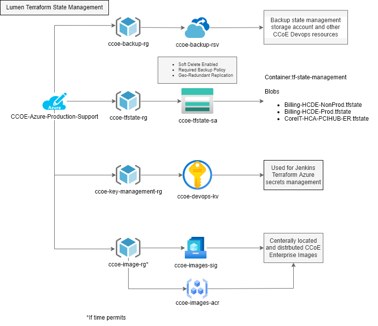
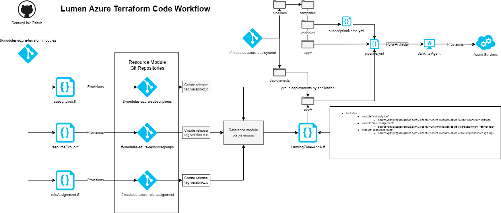

# Terraform Modules Management System

This repository manages Github for the TerraformModules Project.

[[_TOC_]]

## Pre-Requists

To update a Terraform modules you must have the following pre-requsities installed on your command line.

- [git](https://git-scm.com/)
- [terraform](https://developer.hashicorp.com/terraform/downloads?ajs_aid=0835a637-6988-4cf7-add0-175cd138d93f&product_intent=terraform)
- [pre-commit](https://pre-commit.com/index.html)
- [Az-cli](https://learn.microsoft.com/en-us/azure/cost-management-billing/manage/assign-roles-azure-service-principals#permissions-that-can-be-assigned-to-the-spn)
- Github SSH Authentication [Add SSH Key to your Github Account](https://docs.github.com/en/authentication/connecting-to-github-with-ssh/adding-a-new-ssh-key-to-your-github-account)
- Github PAT Token [Creating a personal access token - GitHub Docs](https://docs.github.com/en/authentication/keeping-your-account-and-data-secure/creating-a-personal-access-token)
  - Required for creating new repositories, supplied in terraform-modules [variables.tf](./terraform/variables.tf) pat_token variable

### Pre-Commit

All modules have pre-commit hooks which perform basic formatting and generate documentation with [Terraform-Docs](https://github.com/terraform-docs/terraform-docs). Pre-commit hooks will run on commit. When creating a new repo ensure .pre-commit is in place and run `pre-commit install`. If they fail you must `$ git add -u` and commit again to add changes built by automatic tooling.

### SPN Configuration

An Azure service principal is an identity created for use with applications, hosted services, and automated tools to access Azure resources. This access is restricted by the roles assigned to the service principal, giving you control over which resources can be accessed and at which level. It is a recommended security identity used by automation services to provision specific Azure resources. It is similar to a user account but instead of representing a person, it represents the automation service. To utilize the features required by the landing zone solution ensure the following SPN Permissions are configured:

- Create EA Subscriptions
  - SubscriptionCreator role [Assign roles to Azure Enterprise Agreement service principal names](https://learn.microsoft.com/en-us/azure/cost-management-billing/manage/assign-roles-azure-service-principals#permissions-that-can-be-assigned-to-the-spn)
- Microsoft Graph Permissions to manage applications and Azure AD objects [Microsoft Graph permissions reference - Microsoft Graph | Microsoft Learn](https://learn.microsoft.com/en-us/graph/permissions-reference)
  - Application.ReadWrite.All
  - Application.ReadWrite.OwnedBy
  - Directory.Read.All
  - User.Read.All
- Manage the Management Groups, Subscriptions and Resources
  - Azure RBAC: Assign Contributor and User Access Administrator at the Tenant Root Management Group

## Terraform Devops Infrastructure



The CCOE team has a dedicated subscription to support the following

### State management

Terraform must store state about your managed infrastructure and configuration. This state is used by Terraform to map real world resources to your configuration, keep track of metadata, and to improve performance for large infrastructures. Terraform uses state to determine which changes to make to your infrastructure. Prior to any operation, Terraform does a refresh to update the state with the real infrastructure.

A dedicated storage account for the remote storage of Terraform state files should be used for all deployments. The state file name should mirror the scope of the resource it is creating. Example state file names would include:

- ``Infra.Ops-CCOE-HCA-key-management-rg.tfstate``  
Terraform state file scoped to the Infra.Ops-CCOE-HCA-key-management-rg resource group

- ``Infra.Ops-CCOE-HCA-automation-POC.tfstate``
Terraform state file scope to the Infra.Ops-CCOE-HCA-automation-POC subscription/landing zone

### Secrets management

## Terrform Repository Overview



### Repository Management

Azure terraform module repositories are managed and created from the tf-modules-azure-terraformmodules repository. To create a new repository add a new .tf file to the [./terraform](./terraform/) directory with the following code snippet replacing `<repository>` & `<resource-name>` with their respective values. Ensuring you have your github ssh keys configured run a terraform apply to deploy.

```terraform
 resource "github_repository" "<repository>" {
  name                 = "tf-modules-azure-<resource-name>"
  visibility           = var.visibility
  auto_init            = true
  topics               = var.topics
  vulnerability_alerts = true
  lifecycle {
    ignore_changes = [
    ]
  }
} 
```

### Deployments

All CCOE/Landing Zone deployments are sourced from the tf-modules-azure-deployment repository for more information see: [tf-modules-azure-landing-zone](https://github.com/CenturyLink/tf-modules-azure-landing-zone/blob/main/README.md)

## Terraform Resource Modules

All modules include usage requirements in their respective readme.

### Methodology

Lumen azure terraform resource modules are intended to jumpstart landing zone and development team deployments. To accellerate adoption, a terraform resource template library has been created in Github with the tf-modules-azure prefix. These modules are developed to allow for flexible configuration, allowing the consumer to be as specific or non-specific as needed while maintaining a default Lumen deployment posture.

tf-modules-azure modules should conform to the following standards:

- Support a single repository per Azure Resource type template  
    - No multiple interations of the same resource
- Support multiple configurations through use of dynamic blocks
- Defined default variable values that support Lumen security posture
- Variables that do not require value default to null

### Sourcing a module

To source a Terraform Module hosted in this project use the following format in your source. Your Git SSH credentials must have access to this project to perform `terraform init`. 

Format Template for Sourcing Terraform
```ccl
source = "git::${SSH_CLONE_URL}?ref=${COMMIT_SHA or GIT_TAG}"
```

Example
```ccl
module "diagnostic_logs" {
  source = "git@github.com:CenturyLink/tf-modules-azure-resourcegroups.git?ref=main"
}
```

## Modules Guidelines
Guidelines when creating or updating modules to keep things organized.

### Creating a new module
- If possible, avoid creating a new module for a resource that already has a module. Make use of dynamic blocks and optional parameters to create new scenarios for the resource.  
- Add a version constraint for the provider (<= <version>).  
  - If possible, add all the existing properties on the version used.  

### Updating an existing module
- Check the version when the new property was introduced.
  - If necessary, add a version constraint
  - If possible, complete all the properties to that specific version

To update a resource module do the following:

- Create a new branch from origin/main
- Complete your code modifications
- Run the test your deployment located in ./test
- Commit your changes
- Create a PR to main for approval
- Once approved, create a git tag with the following syntax
  - vX.X.X iterating on the release type
- Create a new release
  - If breaking changes were introduced include an upgrade path in the description
<!-- BEGIN_TF_DOCS -->
## Requirements

No requirements.

## Providers

No providers.

## Modules

No modules.

## Resources

No resources.

## Inputs

No inputs.

## Outputs

No outputs.
<!-- END_TF_DOCS -->